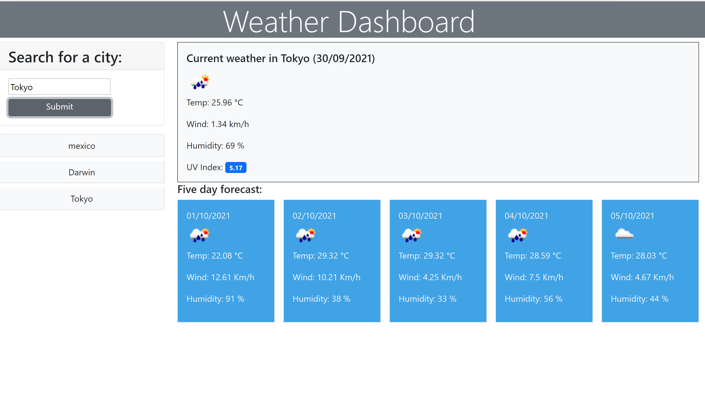
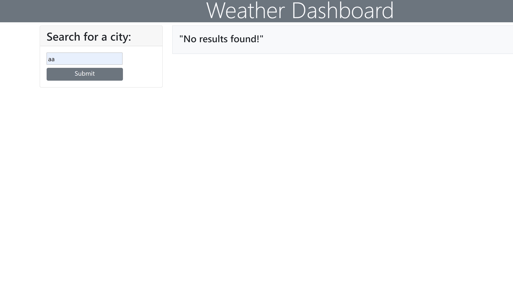

# Weather Dashboard
# Overview

Using this web application a user can view the current weather and a five day forecast for a particular city.

When a user enters a valid city name, the current date weather which includes temp, wind speed, humidity and UV index are displayed for that city. The UV index is color coded to provide more information to the user about whether the conditions are favourable or otherwise.
Icons depicting the current and fucture weather conditions are also displyed.

The application checks for invalid and empty data.

This application is built using HTML5, CSS, JavaScript, Bootstrap, jQuery and moment.js 

## Table of Contents

- [Overview](#overview)
- [Installation](#installation)
- [Usage](#usage)
- [Screenshots](#screenshots)
- [Deployed Application](#deployed-application)
- [Questions](#questions)
- [License](#license)

  ## Installation

  - Clone  the repository.
  - Should have access to Visual Studio
  - Launch the application using the web browser
  

  ## Usage

  The deployed link will launch the application on a web browser. The user can enter the city name for which the they wish to get the current weather and forecast details.

  ## Screenshots
1. 
2. 
3. 

 
 ## Deployed Application
 [Weather Dashboard](https://chaitra-srinivas.github.io/Weather-Dashboard/)

  ## Questions

  For any questions regarding the project please visit my
  GitHub Profile @
  [chaitra-srinivas](https://github.com/dfdfgfd)
  or you can reach me @ cmurthy.dev@gmail.com

  ## License

  [MIT](https://opensource.org/licenses/MIT)
  This application is convered under the MIT License.

  Copyright © 2021 Chaitra Srinivasamurthy

