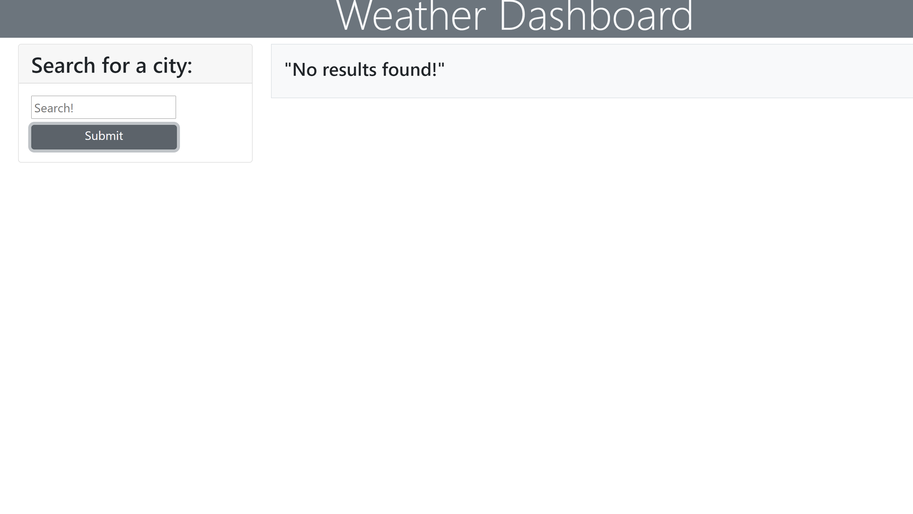

# Weather Dashboard
# Overview

Using this web application a user can view the current weather and a five day forecast for a particular city.

When a user enters a valid city name, the current date weather which includes temp, wind speed, humidity and UV index are displayed for that city. The UV index is color coded to provide more information to the user about whether the conditions are favourable or otherwise.
Icons depicting the current and fucture weather conditions are also displyed.

The application checks for invalid and empty data.

This application is built using HTML5, CSS, JavaScript, Bootstrap, jQuery and moment.js 

Screen shots:
1. 
2. 
3. 

1. ![Deployed application]: https://chaitra-srinivas.github.io/
2. ![Github link]: https://github.com/chaitra-srinivas/Weather-Dashboard
